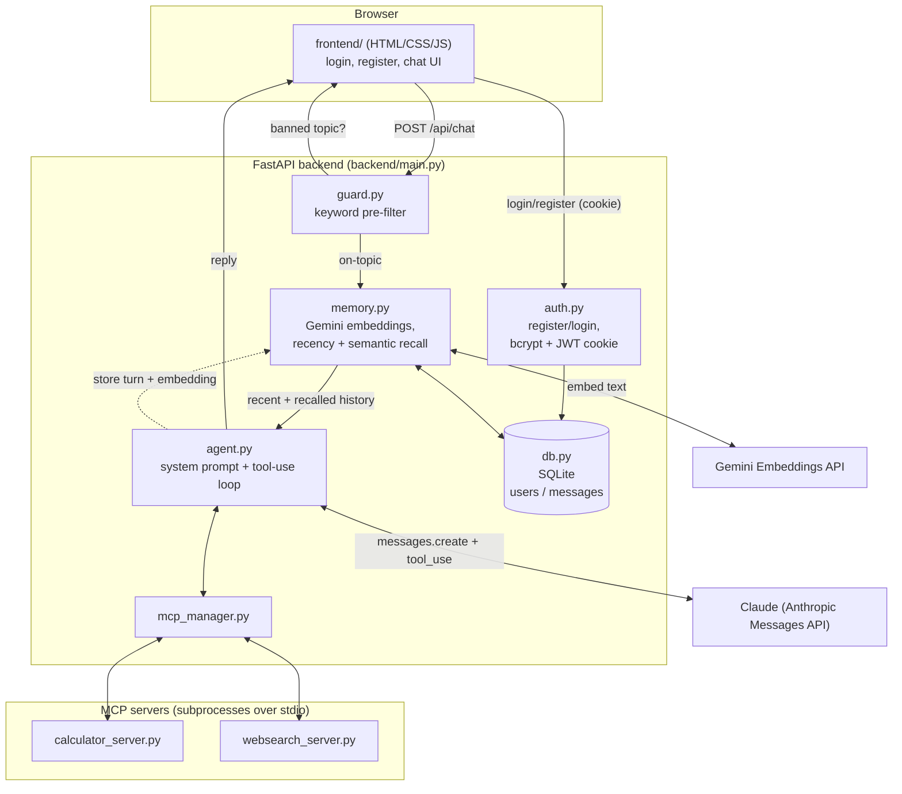

# School Friend AI

A K-12 school-only chatbot web app that provides answers to the students regarding their subjects. It refuses to answer anything outside
school subjects (no religion, politics, entertainment, sports, adult content,
tourism, or party planning), teaches by **giving the definition/answer
straightaway** (with more detail/steps available on request), and uses
Claude (Anthropic) with two tools exposed over local MCP (Model Context
Protocol) servers:

- **`calculate`** - safe math evaluator (arithmetic, trig, logs, factorials, etc.)
- **`web_search`** - DuckDuckGo-backed web search for factual lookups

Students log in with a username/password, and the app **remembers every
conversation permanently** - short-term (recent messages) and long-term
(semantically relevant facts/mistakes from any past session, retrieved via
Gemini embeddings), so context carries over even after logging out and back
in later, on any device.

## Architecture



## How it works

### Chat & tutoring behavior
- **Few-shot prompting**: [backend/agent.py](backend/agent.py) contains
  `SYSTEM_PROMPT`, a system message packed with worked examples showing the
  answer-first pedagogy (definition/explanation/answer up front, deeper
  steps only if asked), tool use, and refusals for every banned category.
  Claude imitates this pattern for new questions.
- **Rule-based guard**: [backend/guard.py](backend/guard.py) does a fast
  keyword pre-check before calling the LLM at all, as a first line of
  defense for the strictly-banned topics.
- **MCP tools**: [backend/mcp_manager.py](backend/mcp_manager.py) spawns the
  two servers in [backend/mcp_servers/](backend/mcp_servers/) as subprocesses
  over stdio, lists their tools, and converts them to Anthropic's tool schema.
  [backend/agent.py](backend/agent.py) runs the tool-use loop.

### Accounts & persistent memory
- **Login portal**: [backend/auth.py](backend/auth.py) handles
  registration/login with bcrypt-hashed passwords, and issues a JWT stored
  in an httponly `session_token` cookie (`/api/register`, `/api/login`,
  `/api/logout`, `/api/me` in [backend/main.py](backend/main.py)). Every
  `/api/chat` request requires this cookie, so history is tied to the
  logged-in student, not a random browser ID.
- **Storage**: [backend/db.py](backend/db.py) is a small SQLite database
  (`data/school_friend_ai.db`, gitignored) with `users` and `messages`
  tables - every chat turn is persisted here permanently.
- **Semantic memory**: [backend/memory.py](backend/memory.py) embeds every
  message with Gemini's `gemini-embedding-001` model and stores the vector
  alongside the message. Each turn, it builds:
  1. A **recency window** - the student's last 20 messages, for
     short-term continuity.
  2. A **semantic recall** - the most similar older messages (cosine
     similarity search, in Python/numpy) to the current question, so the
     agent can reference or gently correct something from *any* past
     session, not just the current one.

  Both are merged and spliced into `SYSTEM_PROMPT` in
  [backend/agent.py](backend/agent.py) as a "STUDENT MEMORY" block before
  calling Claude, letting it personalize answers or build on/correct past
  mistakes. If `GEMINI_API_KEY` isn't set or the embeddings call fails,
  messages are still saved (without embeddings) and the chat keeps working
  - memory is best-effort, never a hard dependency.
- **Backend**: [backend/main.py](backend/main.py) is a FastAPI app exposing
  the auth endpoints plus `POST /api/chat`, and serves the static frontend.
  It catches `anthropic.AuthenticationError`/`anthropic.APIError` from the
  LLM call and returns a friendly, actionable chat message instead of a raw
  500 (e.g. if `ANTHROPIC_API_KEY` is missing/invalid).
- **Frontend**: [frontend/](frontend/) is a vanilla HTML/CSS/JS app with a
  login/register screen followed by the chat UI; it authenticates via the
  httponly cookie (no tokens in JS/localStorage) and bounces back to the
  login screen if a request comes back `401`.

## Request flow (one chat turn)

1. Browser sends `POST /api/chat` with the session cookie attached.
2. `guard.py` keyword-checks the message; banned topics short-circuit with
   a canned refusal (no LLM/DB calls).
3. On-topic messages go to `memory.py`, which pulls the recency window +
   semantically recalled messages for that `user_id` from SQLite.
4. `agent.py` sends the system prompt (base rules + recalled memory) plus
   the message history to Claude, running the tool-use loop against
   `calculate`/`web_search` via `mcp_manager.py` as needed.
5. The reply is returned to the browser, then both the user message and
   the reply are embedded (Gemini) and saved to SQLite for future recall.

## Setup

```bash
source venv/bin/activate
pip install -r requirements.txt
cp .env.example .env
# then edit .env and set your real ANTHROPIC_API_KEY and GEMINI_API_KEY,
# plus a random SESSION_SECRET, and SAVE the file
```

Generate a strong `SESSION_SECRET` (used to sign login session cookies):

```bash
python3 -c "import secrets; print(secrets.token_hex(32))"
```

`GEMINI_API_KEY` (used only for embeddings/long-term memory, not chat
replies) can be created at https://aistudio.google.com/apikey.

> If you see the chat reply "I can't reach my AI service right now (invalid
> API key)", it means `.env` still has the placeholder key (or an unsaved
> edit) - double-check the file on disk has your real
> `ANTHROPIC_API_KEY` and restart the server.

## Run

```bash
source venv/bin/activate
uvicorn backend.main:app --reload --port 8000
```

Open http://127.0.0.1:8000 in your browser, create an account (or log in),
and start chatting.

## Try it

- "Explain the water cycle for a 7th grader." -> full explanation right
  away; ask a follow-up (e.g. "tell me more about condensation") for more
  detail.
- "Solve 2x + 5 = 13" -> direct answer with the worked steps (uses the
  `calculate` tool for the final arithmetic).
- "What year did India gain independence?" -> uses the `web_search` tool.
- "What movie should I watch?" / "Who will win the election?" -> refused
  (banned categories), redirected to a school topic.
- Log out and log back in (or ask something similar to an earlier
  question) -> the agent still recalls prior context from SQLite/semantic
  memory.

## Notes / next steps

- Conversation history and accounts are stored permanently in SQLite
  (`data/school_friend_ai.db`) - fine for local/single-instance use; swap
  in Postgres + a dedicated vector store (e.g. pgvector) for a real
  multi-worker/production deployment, since the current cosine-similarity
  recall is brute-force over each user's messages in Python.
- `ANTHROPIC_MODEL` in `.env` defaults to `claude-sonnet-4-5-20250929`;
  change it if you want a different Claude model.
- The keyword guard in `guard.py` is intentionally simple; extend
  `BANNED_CATEGORIES` if you find gaps.
- `SESSION_SECRET` should be a long random string - anyone who has it could
  forge login sessions.

